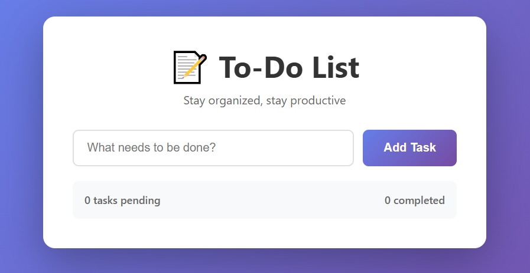

# To-Do List App

A clean, interactive, and fully functional to-do list application built with **HTML5**, **CSS3**, and **JavaScript** as part of the Web Development Internship – Task 2.

## 🌐 Live Preview

Open `index.html` with the **Live Server** extension in VS Code to start using the app.

## 📸 Preview



---

## 📁 Project Structure

```
Day 2 - Todo App/
├── index.html        # Main HTML file with semantic structure
├── style.css         # Stylesheet with animations, transitions & responsive design
├── script.js         # JavaScript logic for task management
├── README.md         # This file
└── index.png         # Preview screenshot
```

---

## 🛠️ Setup & Usage

1. **Clone or download** this repository.
2. Open the project folder in **VS Code**.
3. Right-click on `index.html` → **Open with Live Server**.
4. Start adding, completing, and deleting tasks!

---

## ✨ Features

- **Add tasks** via button click or pressing Enter
- **Mark tasks as complete** with visual feedback (strikethrough & color change)
- **Delete tasks** with smooth fade-out animation
- **Real-time task counter** showing pending and completed tasks
- **Input validation** with animated error messages
- **Smooth animations** for adding, completing, and removing tasks
- **Fully responsive** design that adapts to mobile screens
- **CSS custom properties** and gradient theming for consistent design

---

## 🎨 Design Choices

- **Color Palette:** Purple gradient (`#667eea` to `#764ba2`) background with clean white card
- **Typography:** System font stack (`Segoe UI`, Tahoma, Verdana) for fast loading
- **Animations:** Slide-in for new tasks, fade-out for deleted tasks, hover effects on buttons
- **Cards:** Soft backgrounds with color-coded states (green for completed, red for delete)

---

## 🧠 Key Learnings

1. **DOM Manipulation:** Creating, updating, and removing elements dynamically with JavaScript (`document.createElement`, `classList.toggle`, `querySelector`).
2. **Event Handling:** Listening to clicks, keypresses (Enter key support), and dynamically attaching event listeners to generated elements.
3. **State Management:** Maintaining a tasks array in memory to track all tasks, their IDs, and completion status.
4. **CSS Animations:** Using `@keyframes` for slide-in, fade-out, and slide-down effects to enhance user experience.
5. **Responsive Design:** Media queries at `600px` to stack input fields and buttons vertically on mobile devices.
6. **Error Handling:** Displaying and hiding validation messages with timeout functionality for better UX.

---

## 💡 Interview Q&A Highlights

| Question | Answer |
|----------|--------|
| **How do you add elements to the DOM?** | Use `document.createElement()` to create the element, set its properties, then append it using `parent.appendChild()` or `parent.append()`. |
| **What is event delegation?** | Instead of attaching listeners to each child, attach one listener to a parent and use `event.target` to handle clicks on specific children. Improves performance. |
| **How does CSS animation work?** | Define `@keyframes` with start and end states, then apply the `animation` property to an element with duration, timing function, and optional delay. |
| **What is the difference between `let`, `const`, and `var`?** | `var` is function-scoped and hoisted. `let` is block-scoped and can be reassigned. `const` is block-scoped and cannot be reassigned (but objects/arrays can be mutated). |
| **How do you handle form input validation?** | Check if input is empty or invalid before processing. Show error messages visually, highlight the input field, and optionally use `setTimeout` to auto-hide errors. |
| **What is the purpose of `dataset` in JavaScript?** | `element.dataset` allows you to access custom `data-*` attributes on HTML elements, useful for storing IDs or metadata directly in the DOM. |
| **How do you make animations performant?** | Use `transform` and `opacity` properties instead of `width`, `height`, or `margin` since they don't trigger layout reflows and are GPU-accelerated. |

---

## ✅ Checklist

- [x] HTML, CSS, and JavaScript files properly linked and structured
- [x] Task creation, completion, and deletion implemented
- [x] Real-time task counter working
- [x] Input validation with error messages
- [x] Smooth CSS animations and transitions
- [x] Responsive design for mobile devices
- [x] Live Server used for testing
- [x] Clear README.md with approach and learnings

---

## 📄 License

This project is built for educational and internship purposes.
